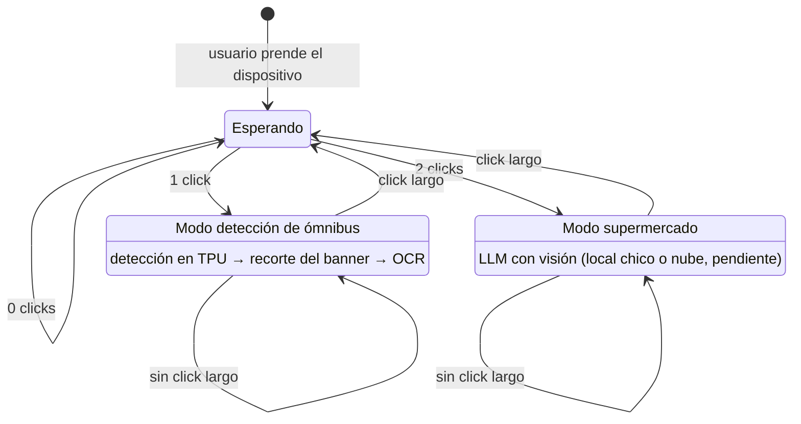

# Architecture

System architecture, component and data-flow diagrams, and Architecture Decision Records (ADRs).

- **System overview** — app ↔ device ↔ (optional) phone-side processing.
- **App ↔ device integration** — the two channels: BLE (GATT) for data/control + a separate audio
  channel (A2DP/HFP or wired) for the recognition TTS to the device earphone.
- **Recognition data flow** — per use case since [ADR 0006](adr/0006-pipelines-por-caso-de-uso.md):
  buses = on-device detection (Coral TPU) → banner crop → OCR → announcement; supermarket =
  vision LLM (local small model or cloud, pending) → announcement.
- **ADRs** — see [`adr/`](adr/) for the full index (0001 offline-first, 0002 Supabase,
  0004 on-device runtime, 0006 pipelines por caso de uso, 0007 botones físicos y modos).
  To backfill: RPi Zero 2 W + Coral TPU, React Native (Expo), on-device vs. offload-to-phone.

## Modos de operación (diagrama canónico)

Decidido en [ADR 0007](adr/0007-botones-fisicos-modos-de-operacion.md): el reconocimiento
funciona por **modos explícitos** activados con el botón físico del dispositivo — nunca audio no
solicitado. Cada modo mapea a un pipeline de
[ADR 0006](adr/0006-pipelines-por-caso-de-uso.md). Este diagrama es la fuente canónica; los ADRs
y la skill lo referencian sin duplicarlo.

En reposo el dispositivo está **conectado y esperando**: ni captura ni anuncia. Cada transición de
modo se anuncia por audio — el usuario no tiene otro indicador de estado.
