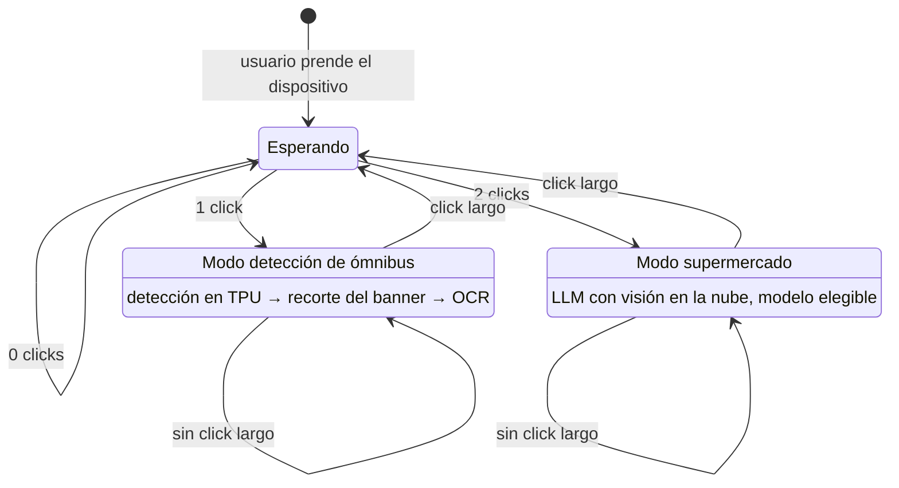
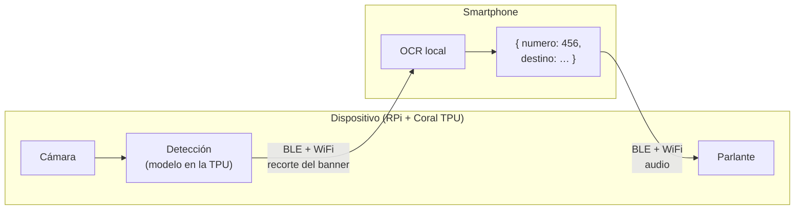
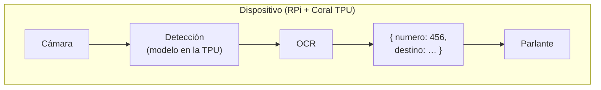
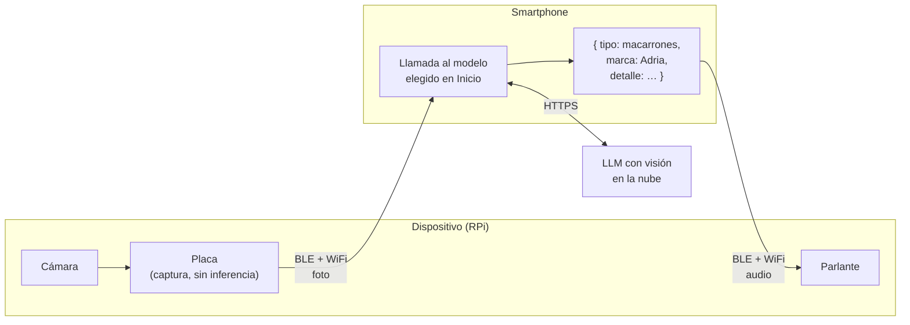

# Architecture

System architecture, component and data-flow diagrams, and Architecture Decision Records (ADRs).

- **System overview** — app ↔ device ↔ (optional) phone-side processing.
- **App ↔ device integration** — [ADR 0003](adr/0003-enlace-placa-telefono.md): BLE (GATT) siempre
  vivo como plano de control (es lo único que despierta a la app con el teléfono en el bolsillo); la
  foto del modo supermercado viaja por BLE o por un AP WiFi de la placa según una medición con umbral;
  el audio sale por un DAC I2S cableado en la placa (no A2DP: compartiría antena con BLE y WiFi).
- **Recognition data flow** — per use case since [ADR 0006](adr/0006-pipelines-por-caso-de-uso.md):
  buses = on-device detection (Coral TPU) → banner crop → OCR → announcement; supermarket =
  cloud vision LLM chosen by the user → announcement (decided 2026-08-30; the local fallback is
  still open). Los tres flujos, dibujados, en [Flujos por caso de uso](#flujos-por-caso-de-uso).
- **ADRs** — see [`adr/`](adr/) for the full index (0001 offline-first, 0002 Supabase, 0003 enlace
  placa ↔ teléfono, 0004 on-device runtime, 0006 pipelines por caso de uso, 0007 botones físicos y
  modos, 0008 proxy de claves).
  To backfill: RPi Zero 2 W + Coral TPU, React Native (Expo), on-device vs. offload-to-phone.

## Modos de operación (diagrama canónico)

Decidido en [ADR 0007](adr/0007-botones-fisicos-modos-de-operacion.md): el reconocimiento
funciona por **modos explícitos** activados con el botón físico del dispositivo — nunca audio no
solicitado. Cada modo mapea a un pipeline de
[ADR 0006](adr/0006-pipelines-por-caso-de-uso.md). Este diagrama es la fuente canónica; los ADRs
y la skill lo referencian sin duplicarlo.

En reposo el dispositivo está **conectado y esperando**: ni captura ni anuncia. Cada transición de
modo se anuncia por audio — el usuario no tiene otro indicador de estado.

## Flujos por caso de uso

Transcripción de [`documents/logicas-casos-de-uso.pdf`](../../documents/logicas-casos-de-uso.pdf),
el diagrama dibujado a mano en el que se acordaron los tres flujos. Están acá en mermaid y no como
imagen porque así se versionan como texto, se leen en un diff y GitHub los renderiza; el PDF queda
como registro de la fuente.

En los tres, el **audio siempre sale por el parlante del dispositivo**: el usuario tiene las manos
libres y no mira el teléfono. Lo que cambia entre casos es **dónde corre cada modelo** y, por lo
tanto, qué viaja por el enlace.

### Caso ómnibus A — modelo parcial en la Raspi

La TPU hace de **preprocesadora**: detecta el ómnibus y recorta el banner, y por el enlace viaja
el **recorte**, no el frame entero. El OCR corre en el teléfono.

### Caso ómnibus B — modelo completo en la Raspi

Todo en el dispositivo: no hay enlace en el camino de reconocimiento, y el teléfono no participa.
Es el caso que mejor cumple ADR 0001, y el que más exige del hardware.

### Caso supermercado — modelo en la nube

El dispositivo sólo captura y transmite; el reconocimiento lo hace un **LLM con visión** al que
llama la app. Es el único camino que sale a internet (ADR 0001 enmendado + ADR 0006): el usuario
está quieto frente a la góndola y tolera latencia a cambio de precisión.

**Mientras no haya hardware, la cámara del teléfono ocupa el lugar de la placa** y el anuncio sale
por el parlante del teléfono — el resto del flujo es idéntico, y por eso se puede desarrollar y
evaluar hoy.

> **Estado (2026-09-01).** El caso supermercado es el que está en desarrollo. Los dos casos de
> ómnibus quedaron **en stand by**: la app implementa hoy el camino local (OCR sobre la foto) que
> ambos comparten, y elegir entre A y B depende de tener el hardware para medirlos.
>
> **Actualización (2026-09-04).** El equipo eligió el **caso B** para ómnibus (todo en la placa) y
> confirmó el flujo de supermercado tal como está dibujado. El "BLE + WiFi" de las flechas se
> resuelve en [ADR 0003](adr/0003-enlace-placa-telefono.md): BLE siempre, WiFi sólo si la medición
> de throughput lo pide.
